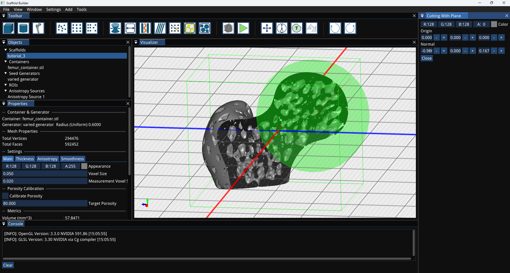

# 🚀 ScaffoldBuilder: An Open-Source Tool for Creating Trabecular Bone Scaffolds



ScaffoldBuilder is a free, open-source (GPL v3) software tool that provides a user-friendly **Graphical User Interface (GUI)** for creating customizable scaffold meshes. Designed for researchers and engineers, it enables precise control over scaffold generation, making it ideal for biomechanical and tissue engineering applications.

---

## ✅ Features

- Create complex trabecular bone scaffolds with adjustable parameters.
- Interactive GUI for real-time preview and customization.
- Supports export to common 3D mesh formats (e.g., STL, OBJ).
- Open-source under **GPL v3** - freedom to use, modify, and share.

---

## 🛠️ Installation and Build Instructions

ScaffoldBuilder is tested on **Windows 11** with **Visual Studio 2022**. Support for **Ubuntu** is planned.

### Download the Prebuilt Release (Recommended)

Most users do not need to build from source. Grab the latest Windows build from the [**Releases** page](https://github.com/konris87/scaffoldBuilder/releases/latest):

1. Download `scaffoldBuilder-<version>-win64.zip`.
2. Extract it anywhere.
3. Run `bin\scaffoldBuilder.exe`.

The archive is self-contained — no separate Visual C++ redistributable is required. A `User_Guide.pdf` with tutorials is attached to each release.

### Build from Source

### Prerequisites

- **Git**
- **CMake 3.20+**
- **Visual Studio 2022** (with C++ development tools)

### Windows Installation

1. Clone the repository:
   ```bash
   git clone https://github.com/konris87/scaffoldBuilder.git
   cd scaffoldBuilder
   ```
2. Open **CMake GUI**:
   - Set "Where is the source code" to the repository folder.
   - Set "Where to build the binaries" to a new build folder (e.g., `scaffoldBuilder/build`).
   - Click **Configure** and select "Visual Studio 17 2022".
   - Click **Generate** and **Open Project**.
3. Build and run the project in Visual Studio.

### Ubuntu Installation (Coming Soon)

Instructions for Linux platforms will be added soon.

---

## 📖 Documentation

Comprehensive documentation is available in the `doc` folder, covering:

- Tool utilities
- Export capabilities
- Known limitations
- Usage examples

---

## 📝 Contributing

Contributions are welcome! Feel free to:

- Fork the repository
- Create feature branches
- Submit pull requests

For major changes, please open an issue first.

---

## 🛡️ License

This project is licensed under the **GNU GPL v3 License** - see the [LICENSE](LICENSE) file for details.

---

## 📚 Citation

If you use ScaffoldBuilder in your research, **please cite:**

1. _[Citation placeholder — Authors, "Paper title", Journal/Conference, Year. DOI]_

Each release is archived on Zenodo with a citable DOI:

[](https://doi.org/10.5281/zenodo.XXXXXXX)

> Replace the placeholder DOI once the repository is linked to Zenodo (Zenodo → GitHub → enable the `scaffoldBuilder` repo, then publish a release; Zenodo mints the DOI and badge automatically).

---

## 🙌 Acknowledgements

This work has been developed as part of the OSTEONET project, funded by the European Union’s Horizon Europe research and innovation program under the Marie Sklodowska-Curie-RISE Grant Agreement No. 101086329


